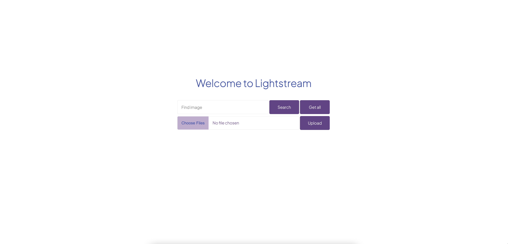
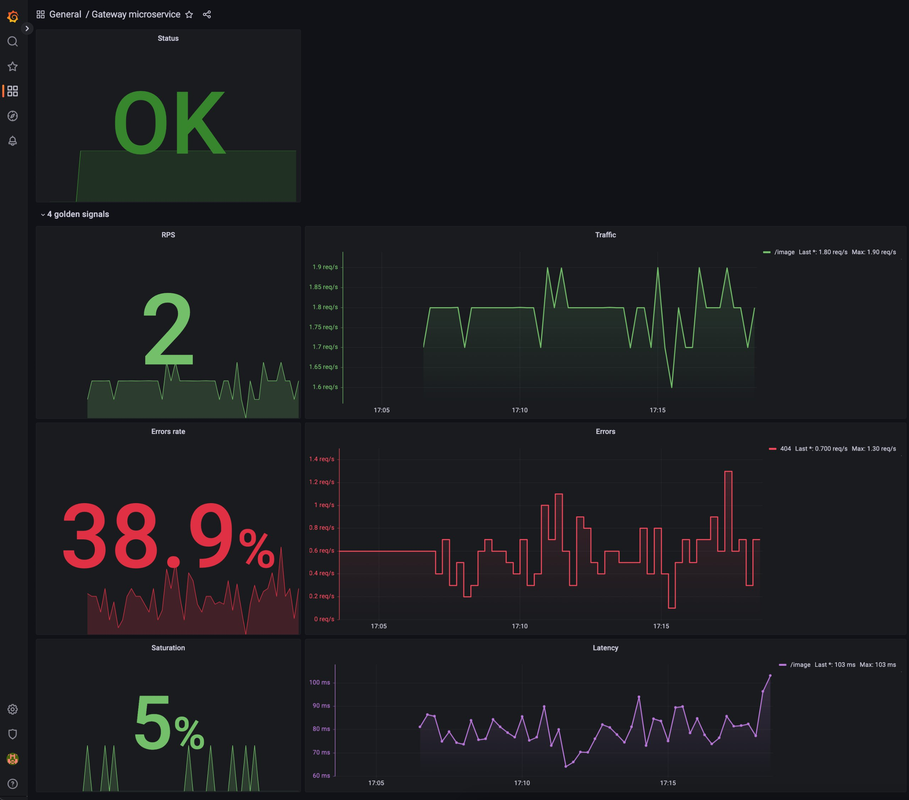
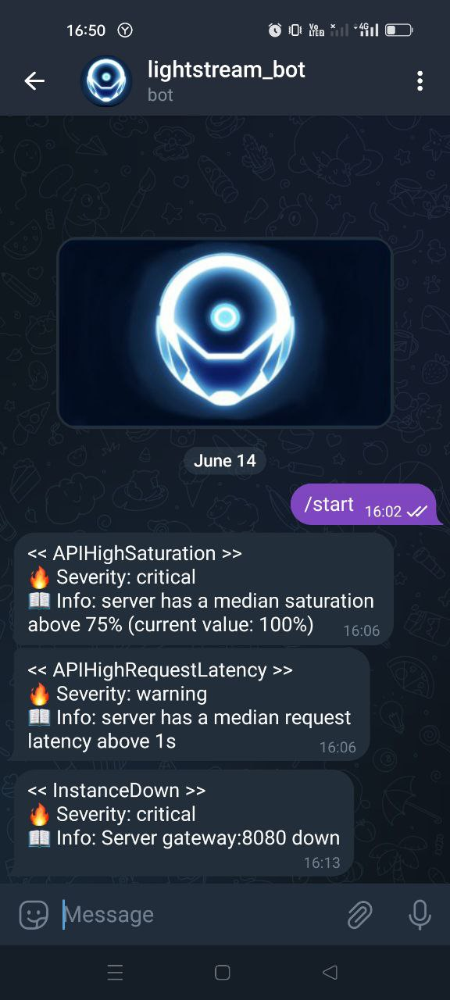

<!-- PROJECT LOGO -->
<br />
<div align="center">

<h2 align="center">Lightstream</h3>

  <p align="center">
    Photo hosting microservice application
    <br />
    <br />
    <a href="https://github.com/rvinnie/lightstream/issues">Report Bug</a>
    ·
    <a href="https://github.com/rvinnie/lightstream/issues">Request Feature</a>
  </p>
</div>


<!-- TABLE OF CONTENTS -->
<details>
  <summary>Table of Contents</summary>
  <ol>
    <li><a href="#about-the-project">About The Project</a>
      <ul>
        <li><a href="#project-structure">Project Structure</a></li>
      </ul>
    </li>
    <li><a href="#getting-started">Getting Started</a>
      <ul>
        <li><a href="#installation">Installation</a></li>
      </ul>
    </li>
    <li><a href="#usage">Usage</a></li>
    <li><a href="#monitoring">Monitoring</a></li>
    <li><a href="#roadmap">Roadmap</a></li>
    <li><a href="#contributing">Contributing</a></li>
    <li><a href="#contact">Contact</a></li>
  </ol>
</details>

## About The Project

This project is a photo hosting implementation aimed at learning microservice architecture and devops culture.

Technologies used:
* [Golang](https://go.dev/), [PostgreSQL](https://www.postgresql.org/)
* [gRPC](https://grpc.io/), [REST](https://ru.wikipedia.org/wiki/REST), [AMQP](https://ru.wikipedia.org/wiki/AMQP) ([RabbitMQ](https://www.rabbitmq.com/))
* [Docker](https://www.docker.com/), [CI/CD](https://ru.wikipedia.org/wiki/CI/CD), [Github Actions](https://github.com/features/actions), [Terraform](https://www.terraform.io/), [Kubernetes](https://kubernetes.io/)
* [Amazon S3](https://aws.amazon.com/s3/), [Yandex Cloud](https://cloud.yandex.com/en-ru/)
* [NGINX](https://nginx.org/)
* [Prometheus](https://prometheus.io/), [Grafana](https://grafana.com/)
* [Python](https://www.python.org/), [JS](https://developer.mozilla.org/en-US/docs/Web/JavaScript), [HTML](https://developer.mozilla.org/en-US/docs/Web/HTML), [CSS](https://developer.mozilla.org/en-US/docs/Web/CSS)

### Project Structure
TODO: add project diagram


Go to the <a href="#getting-started">Getting Started</a> to try the project locally.

<p align="right">(<a href="#readme-top">back to top</a>)</p>

<!-- GETTING STARTED -->
## Getting Started

This is an example of how you may give instructions on setting up your project locally.
To get a local copy up and running follow these example steps.

### Installation

1. Clone the repo
   ```sh
   git clone https://github.com/rvinnie/lightstream
   ```
2. Set environment variables  
   - `services/gateway/.env`  
   ```sh
   POSTGRES_USER=<postgres user>
   POSTGRES_PASSWORD=<postgres password>
   POSTGRES_DB=<database name>
   DATABASE_HOST=postgres_gateway
   
   RABBIT_USER=<RabbitMQ user>
   RABBIT_PASSWORD=<RabbitMQ password>
   
   GIN_MODE=debug
   ```
   - `services/history/.env`
   ```sh
   POSTGRES_USER=<postgres user>
   POSTGRES_PASSWORD=<postgres password>
   POSTGRES_DB=<database name>
   DATABASE_HOST=postgres_history
   
   RABBIT_USER=<RabbitMQ user>
   RABBIT_PASSWORD=<RabbitMQ password>
   ```
   - `services/history/.env`
   ```sh
   AWS_ACCESS_KEY_ID=<Yandex Cloud access key identifier>
   AWS_SECRET_ACCESS_KEY=<Yandex Cloud secret access key>
   AWS_REGION=ru-central1
   ```
   - `monitoring/alertmanager/alertmanager.yml`
   ```yml
   ...
   - bot_token: <telegram bot token (string)>
     api_url: 'https://api.telegram.org'
     chat_id: <telegram chat id (int)>
   ...
   ```
3. Install [docker](https://www.docker.com/)
4. Choose one of three project versions
   - development version
      ```sh
      make
      ```
   - development version with stress testing
      ```sh
      make version=stress
      ```
   - production version
      ```sh
      make version=prod
      ```

<p align="right">(<a href="#readme-top">back to top</a>)</p>

<!-- USAGE -->
## Usage

After launch, go to the address in the browser
`https://localhost`



Here you can add an image to storage, find an image by id and get the whole gallery of images.
All added images are saved in Yandex Cloud Object Storage.  

An example of a gallery with two images (`Upload` two images -> press `Get all`)


<!-- MONITORING -->
## Monitoring
The project is configured to monitor the system with Prometheus and Grafana.  
Welcome to Grafana `http://localhost:3030`



If the server crashes or the load is too high, the Alertmanager will send a notification in Telegram.


<p align="center">
    
</p>

<!-- ROADMAP -->
## Roadmap

- [ ] Add user entity
- [ ] Add authorization microservice (JWT)
- [ ] Add Terraform
- [ ] Add Kubernetes


See the [open issues](https://github.com/rvinnie/lightstream/issues) for a full list of proposed features (and known issues).

<p align="right">(<a href="#readme-top">back to top</a>)</p>

<!-- CONTRIBUTING -->
## Contributing

Contributions are what make the open source community such an amazing place to learn, inspire, and create. Any contributions you make are **greatly appreciated**.

If you have a suggestion that would make this better, please fork the repo and create a pull request. You can also simply open an issue with the tag "enhancement".
Don't forget to give the project a star! Thanks again!

1. Fork the Project
2. Create your Feature Branch (`git checkout -b feature/AmazingFeature`)
3. Commit your Changes (`git commit -m 'Add some AmazingFeature'`)
4. Push to the Branch (`git push origin feature/AmazingFeature`)
5. Open a Pull Request

<p align="right">(<a href="#readme-top">back to top</a>)</p>

<!-- CONTACT -->
## Contact

Alexey Fedoseev - [@fedoseev_alexey](https://t.me/fedoseev_alexey) - rv1nnie@yandex.ru

Project Link: [Lightstream](https://github.com/rvinnie/lightstream)

<p align="right">(<a href="#readme-top">back to top</a>)</p>